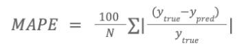

Геоаналитические сервисы помогают оценивать привлекательность различных локаций с точки зрения инвестиций, определять перспективы и возможности развития территорий и инфраструктуры, а также формировать оптимальную цену для сдачи и продажи недвижимости. 

В рамках данной задачи Вам необходимо на основе данных о районе, доме, квартире и других географических сведений построить модель, позволяющую предсказывать стоимость квартиры за квадратный метр.

Данные
Для построения модели Вам будут доступны различные данные о совершенных сделках с известным значением целевой переменной price_target, а также тестовый набор, для которых необходимо сделать прогноз.

Целевая переменная анонимизирована, то есть не является исходной ценой за квадратный метр из сделки, но зависит только от нее.

Расшифровку названий признаков можно найти в файле Расшифровка.xlsx, приложенном к задаче.

Вам необходимо сделать прогноз для всех объектов, которые находятся в файле с тестовыми данными. 

Пример файла, содержащего спрогнозированные значения - sample_submission.csv

 
Метрика
Метрика качества решения MAPE определяется следующей формулой:

 , где
N – общее количество объектов,

ytrue – реальное значение целевой переменной,

ypred – спрогнозированное значение целевой переменной
 

Расчет балла
Промежуточный балл, отображаемый в таблице результатов до момента завершения раунда, рассчитывается по формуле:

Score = - MAPE
, где MAPE – значение метрики, рассчитанное по указанной выше формуле.
Таким образом, промежуточный балл строится по принципу "чем больше абсолютная величина ошибки, тем меньше результат". Максимально возможный промежуточный балл равен 0.

Окончательный балл рассчитывается после завершения раунда по следующей формуле:

Points = 400 * percentileofscore(MAPEs, MAPE)
, где

percentileofscore – функция, вычисляющая percentile rank,

MAPEs – значения метрик MAPE всех участников,

MAPE – значение метрики MAPE данного участника.